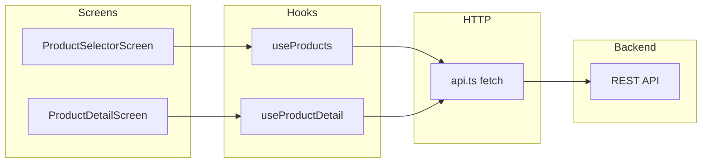

# Developer handbook (Confluence-ready)

Use this document as the canonical onboarding reference for the **a.iwish** mobile app. To publish in Confluence: import Markdown or paste sections; use **Code Block** macros for commands and snippets.

**Canonical copy in repo:** this file. **Quick start:** see the root [README](../README.md).

---

## 1. Product and scope

**a.iwish** ([`app.json`](../app.json)) is an Expo React Native app for a **smart wishlist** with **ML price prediction** and **multi-retailer price history**. Users pick a product on **Product Selector**, then open **Product Detail** for charts, retailer comparison, and predictions.

The app is **API-driven**: there is no bundled mock product catalog. All data comes from a backend implementing the contract in [`src/services/api.ts`](../src/services/api.ts).

---

## 2. Technology stack

| Area | Choice |
|------|--------|
| Runtime | Expo SDK ~54 ([`package.json`](../package.json)), React 19, React Native 0.81 |
| Language | TypeScript (strict, [`tsconfig.json`](../tsconfig.json)) |
| Navigation | `@react-navigation/native` + `@react-navigation/native-stack` |
| UI | React Native core + `react-native-svg` (charts), `react-native-safe-area-context`, `react-native-gesture-handler`, `react-native-reanimated`, `react-native-screens` |
| New Architecture | Enabled: `"newArchEnabled": true` in [`app.json`](../app.json) |
| Web | `react-native-web` + `react-dom` (Expo web target) |

**Tooling in repo:** `npm run typecheck`, GitHub Actions workflow for typecheck on push/PR. **Still optional:** automated tests, EAS Build/Submit (`eas.json`).

---

## 3. Repository layout (source of truth)

| Path | Role |
|------|------|
| [`App.tsx`](../App.tsx) | `ThemeProvider` → `NavigationContainer` → stack: `ProductSelector` → `ProductDetail` |
| [`index.ts`](../index.ts) | Expo `registerRootComponent` |
| [`app.json`](../app.json) | Expo name, slug, icons, iOS bundle id `com.anonymous.aiwish`, Android edge-to-edge |
| [`src/navigation/types.ts`](../src/navigation/types.ts) | `RootStackParamList`: `ProductDetail` takes `{ productId: string }` |
| [`src/services/api.ts`](../src/services/api.ts) | All HTTP calls; base URL and endpoints |
| [`src/types/product.ts`](../src/types/product.ts) | Shared DTOs aligned with API responses |
| [`src/hooks/useProducts.ts`](../src/hooks/useProducts.ts) | List: `fetchProducts` + per-product `fetchProduct` enrichment |
| [`src/hooks/useProductDetail.ts`](../src/hooks/useProductDetail.ts) | Detail: product, series, Keepa, prediction, retailers, comparison rows |
| [`src/context/ThemeContext.tsx`](../src/context/ThemeContext.tsx) | Light/dark toggle; default **dark** |
| [`src/styles/theme.ts`](../src/styles/theme.ts) | Colors, spacing, typography, shadows, `appIconSizes` |
| [`src/components/`](../src/components/) | `ProductCard`, `PriceChart`, `PriceDisplay`, `RecommendationCard`, `BrandWordmark`, etc.; barrel [`index.ts`](../src/components/index.ts) |
| [`src/utils/`](../src/utils/) | Pricing/chart logic: `trustedRetailers`, `lowestCurrentOffer`, `priceSeriesAggregate`, `keepaSeriesAggregate`, `predictionMerge`, `retailerChartColors`, etc. |
| [`assets/`](../assets/) | App icon, splash, favicon |

Generated native folders `ios/` and `android/` are gitignored (Expo prebuild workflow if you add them later).

---

## 4. Prerequisites

- **Node.js** (LTS recommended) and npm
- **Expo CLI** via `npx` (no global install required)
- **For physical devices:** Expo Go app, or dev builds after `expo prebuild`
- **For `expo run:ios` / `expo run:android`:** Xcode (macOS) and/or Android Studio + SDKs

---

## 5. Commands (daily use)

Install dependencies:

```bash
npm install
```

Start Metro + dev tools (same as `npm start`):

```bash
npx expo start
```

Web:

```bash
npx expo start --web
```

Native **development builds** (requires native toolchain):

```bash
npx expo run:ios
npx expo run:android
```

Typecheck (no emit):

```bash
npm run typecheck
```

**Package.json scripts** ([`package.json`](../package.json)): `start`, `android`, `ios`, `web`, `typecheck`. No `lint` or `test` scripts yet.

---

## 6. Configuration and environment

### API base URL

[`src/services/api.ts`](../src/services/api.ts) sets:

```ts
const API_BASE_URL =
  process.env.EXPO_PUBLIC_API_URL?.replace(/\/+$/, '') ?? 'http://localhost:8000';
```

- **Default:** `http://localhost:8000` (simulators/emulators on the same machine).
- **Override:** set `EXPO_PUBLIC_API_URL` (Expo public env — embedded at bundle time; **not for secrets**).

Copy [`.env.example`](../.env.example) to `.env` locally and set values. **`.env` is gitignored** — do not commit secrets. Anything `EXPO_PUBLIC_*` is visible in the client bundle.

**Staging / production:** set `EXPO_PUBLIC_API_URL` per environment (local file, shell, or CI). For EAS builds later, use EAS environment variables in the Expo dashboard.

**Physical device / LAN:** use the host machine’s LAN IP (e.g. `http://192.168.x.x:8000`) or a tunnel; `localhost` on the phone is the phone itself, not your PC.

### App identity

- **Slug / name:** `aiwish`, display name `a.iwish` ([`app.json`](../app.json))
- **iOS bundle:** `com.anonymous.aiwish` — change before App Store release

---

## 7. Backend API contract (required integrations)

All paths are relative to `API_BASE_URL`. The client uses `fetch`, expects JSON, and throws on non-OK responses with status text.

| Method | Path | Purpose |
|--------|------|---------|
| GET | `/api/products` | Product list ([`ProductListResponse`](../src/types/product.ts)) |
| GET | `/api/products/{id}` | Product detail + optional `stats` (Keepa), `prediction` summary ([`ProductDetail`](../src/types/product.ts)) |
| GET | `/api/products/{id}/prices?months={n}&retailer={optional}` | Monthly bucketed history ([`PriceHistoryResponse`](../src/types/product.ts)) |
| GET | `/api/products/{id}/prices/series?months={n}&limit={n}&retailer={optional}` | Raw observations ([`PriceSeriesResponse`](../src/types/product.ts)) |
| GET | `/api/products/{id}/keepa/series?months=…&limit_per_track=…&tracks=…` | Keepa tracks ([`KeepaSeriesResponse`](../src/types/product.ts)); client defaults: 24 months, tracks `NEW,AMAZON`, `limit_per_track` 10000 ([`api.ts`](../src/services/api.ts)) |
| GET | `/api/products/{id}/retailers` | Retailer names ([`RetailersResponse`](../src/types/product.ts)) |
| GET | `/api/products/{id}/prediction` | ML forecast ([`PredictionResponse`](../src/types/product.ts)); app tolerates failure (null) |

**Backend expectations:**

- **CORS:** For **web** (`expo start --web`), the API must allow the dev origin or use a proxy.
- **Consistent `retailer` strings** in history/series (e.g. `Walmart`, `Best Buy`, `Target`, `Amazon` / `Amazon.com`) — see trusted set below.

Manual verification checklist: [BACKEND_API_CHECKLIST.md](./BACKEND_API_CHECKLIST.md).

---

## 8. Architecture (data flow)



- **useProducts:** Loads the list, then **N parallel** `fetchProduct` calls to enrich cards (trusted price, MSRP, ratings from `stats`).
- **useProductDetail:** Loads detail + prediction + retailers; loads **price series** + **Keepa series**; builds multi-retailer monthly series, Amazon line from Keepa when possible, fallback to aggregated raw or legacy monthly API; builds **price comparison** rows (history vs Amazon stats).

---

## 9. Business rules (frontend)

- **Trusted retailers** ([`src/utils/trustedRetailers.ts`](../src/utils/trustedRetailers.ts)): exact names `Walmart`, `Best Buy`, `Target`, `Amazon`, `Amazon.com`.
- **Lowest offer on list** ([`src/utils/lowestCurrentOffer.ts`](../src/utils/lowestCurrentOffer.ts)): minimum among Keepa Amazon prices (`amazon_price`, `new_price`, `new_fba_price`) and list `current_price` when `retailer` is trusted.
- **Amazon in price comparison** ([`useProductDetail.ts`](../src/hooks/useProductDetail.ts)): primarily from **Keepa stats** (`amazon_price` / `new_price`), not Google Shopping history.
- **Chart / comparison sort:** “Big four” order (Walmart, Amazon, Best Buy, Target) then price — see `bigFourRank` in [`useProductDetail.ts`](../src/hooks/useProductDetail.ts).

---

## 10. UI and theming

- Global **dark/light** via [`ThemeContext`](../src/context/ThemeContext.tsx) (toggle on selector header).
- Navigator chrome uses theme colors ([`App.tsx`](../App.tsx)).
- Shared tokens: [`src/styles/theme.ts`](../src/styles/theme.ts) (`spacing`, `borderRadius`, `fontSize`, `shadows`, `appIconSizes`).

---

## 11. Future connections and gaps (roadmap)

| Topic | Notes |
|-------|-------|
| **Production API** | Set `EXPO_PUBLIC_API_URL` per environment; use EAS env vars when EAS is added. |
| **Auth** | No `Authorization` header in [`api.ts`](../src/services/api.ts) yet. |
| **EAS Build / Submit** | Add `eas.json` and store credentials when distributing outside Expo Go. |
| **Tests** | Add unit/e2e tests when product priorities allow. |
| **Push / analytics** | Not integrated. |
| **Deep linking** | Not configured in `app.json` beyond defaults. |

---

## 12. Troubleshooting

| Issue | What to check |
|-------|----------------|
| Empty list / network errors | Backend running; `EXPO_PUBLIC_API_URL`; on device use host LAN IP, not `localhost`. |
| Web CORS errors | API CORS config or dev proxy. |
| iOS/Android build failures | Match Xcode/SDK to Expo SDK 54; run `npx expo doctor`. |

---

## 13. Suggested Confluence structure

Create a parent page **“a.iwish Mobile”** with child pages: **Onboarding & commands**, **API contract**, **Architecture & data rules**, **Release & environments** (expand when EAS exists). Either split sections 1–12 across those pages or keep one long page for small teams.

---

## 14. Linking from Confluence

If Confluence is your source of truth, add the handbook URL in the root [README](../README.md) under **Team documentation** so new developers land in the right place.
